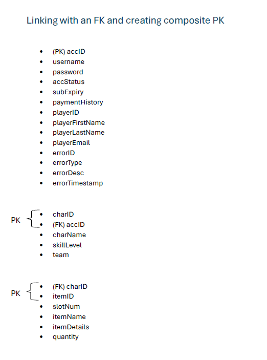
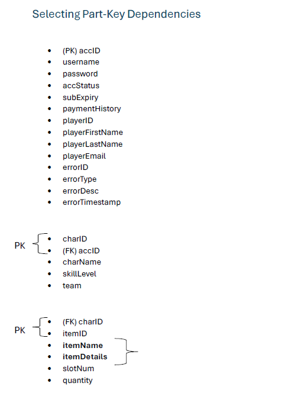
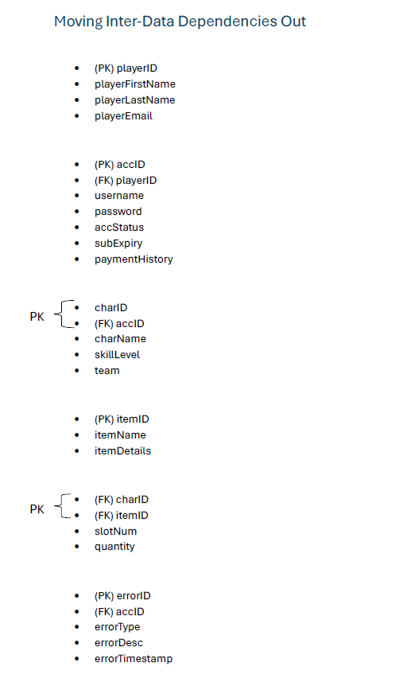
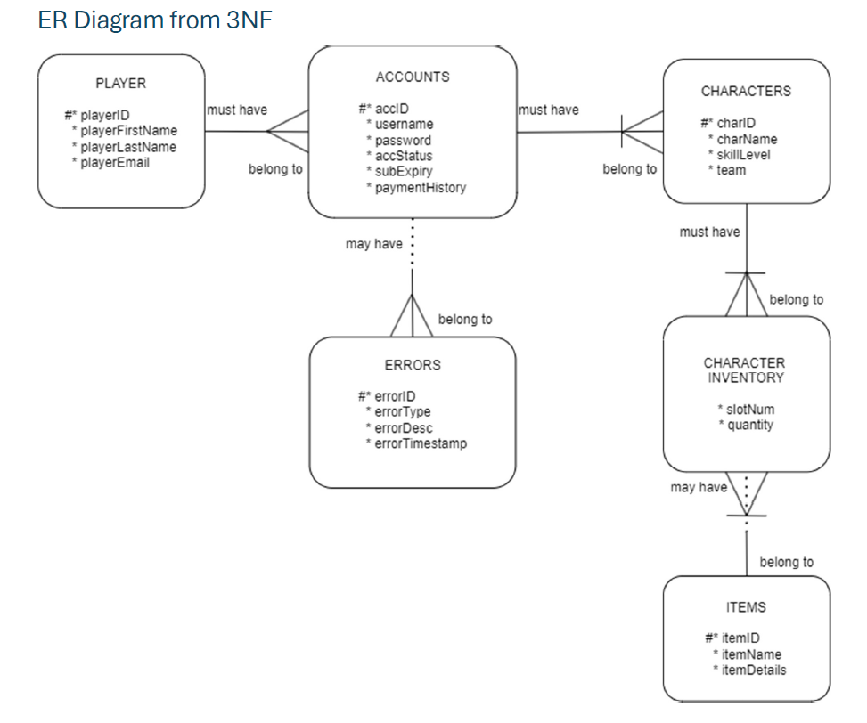

# 🧠 Normalization Process Overview

This project involved normalizing a raw set of MMORPG game-related data to **Third Normal Form (3NF)**, following a structured and methodical approach.

---

## 🔹 Step 1: Understanding the Raw Data (0NF)

The first step was to gather all necessary attributes from the system requirements. The unnormalized data (0NF) included:

- Player details (names, email)
- Account details (login, status, subscription info)
- Character details (name, skill level, team)
- Inventory items (item name, slot, quantity)
- System errors (description, type, timestamp)

This initial dataset was unstructured, contained **repeating groups**, and lacked clear **relational separation** between concepts.

---

## 🔹 First Normal Form (1NF)

### 📌 Selecting Repeating Groups

Repetitive data was separated into new rows or related entities to ensure atomic fields.

---

### 📌 Linking with Foreign Keys & Composite Primary Keys

To normalize the data structure, I introduced unique identifiers and linking keys to define relationships.

---

## 🔹 Second Normal Form (2NF)

### 📌 Selecting Part-Key Dependencies

Attributes that were only dependent on part of a composite primary key were identified.

---

### 📌 Moving Part-Key Dependencies to Separate Groups

These attributes were moved into new related tables to eliminate partial dependencies.

---

## 🔹 Third Normal Form (3NF)

### 📌 Selecting Inter-Data Dependencies

I examined the tables for transitive dependencies — cases where attributes depended on non-key attributes.

---

### 📌 Moving Inter-Data Dependencies Out

I separated indirectly dependent data (e.g. personal details, error logs) into new entities.

---

## 🔄 Final Result: Entity Relationship Diagram (ERD)

The fully normalized 3NF structure is visualized in this ER diagram:

---

## 📊 Final Tables & Sample Data

The following tables represent the fully normalized 3NF structure used in the MMORPG database system. Each table contains key constraints, field requirements, and sample data for clarity.

---

### 🧑‍💼 `Players`

| Column Name      | Key Type | Nulls | Sample Data            |
|------------------|----------|-------|-------------------------|
| `playerID`       | PK, UK   | NN    | `PL1243` / `PL9876`     |
| `playerFirstName`|          | NN    | `John` / `Luke`         |
| `playerLastName` |          | NN    | `Smith` / `Daniels`     |
| `playerEmail`    |          | NN    | `john.smith@gmail.com` / `luke34@hotmail.com` |

---

### 🔐 `Accounts`

| Column Name      | Key Type | Nulls | Sample Data            |
|------------------|----------|-------|-------------------------|
| `accID`          | PK       | NN    | `AC6789` / `AC4321`     |
| `playerID`       | FK → Players | NN | `PL1243` / `PL9876`     |
| `username`       | UK       | NN    | `Johnny61` / `LDaniels1`|
| `password`       |          | NN    | `JSmith61!` / `Pass66!` |
| `accStatus`      |          | NN    | `Active` / `Inactive`   |
| `subExpiry`      |          | NN    | `12-03-25` / `14-04-24` |
| `paymentHistory` |          | NN    | `10-02-25` / `14-03-24` |

---

### 🧝‍♂️ `Characters`

| Column Name  | Key Type | Nulls | Sample Data      |
|--------------|----------|-------|------------------|
| `charID`     | PK       | NN    | `CH001` / `CH456`|
| `charName`   |          | NN    | `Mark` / `Angel` |
| `skillLevel` |          | NN    | `8` / `2`        |
| `team`       |          | NN    | `Sun Team` / `Moon Team` |

---

### 🎒 `CharacterInventory` (Junction Table)

| Column Name | Key Type     | Nulls | Sample Data           |
|-------------|--------------|-------|------------------------|
| `charID`    | PK, FK1 → Characters | NN | `CH001` / `CH456`     |
| `itemID`    | PK, FK2 → Items      | NN | `SW23` / `HP01`       |
| `slotNum`   |           | NN    | `1` / `8`              |
| `quantity`  |           | NN    | `1` / `5`              |

---

### 🗡️ `Items`

| Column Name  | Key Type | Nulls | Sample Data              |
|--------------|----------|-------|---------------------------|
| `itemID`     | PK       | NN    | `SW23` / `HP01`           |
| `itemName`   |          | NN    | `Sun Sword` / `Healing Potion` |
| `itemDetails`|          | NN    | `Attack, +10` / `Health, +5`   |

---

### ⚠️ `Errors`

| Column Name     | Key Type | Nulls | Sample Data                            |
|-----------------|----------|-------|-----------------------------------------|
| `errorID`       | PK       | NN    | `E-407` / `E-101`                        |
| `accID`         | FK → Accounts | NN | `AC6789` / `AC4321`                     |
| `errorType`     |          | NN    | `Login Failure` / `Patch Error`         |
| `errorDesc`     |          | NN    | `Account not found` / `Missing Files`   |
| `errorTimestamp`|          | NN    | `10:00:21-11.03.25` / `08:01:24-13.04.24`|

---

### 🔗 Summary of Key Constraints

- `Players` → `Accounts` via `playerID`
- `Accounts` → `Errors` via `accID`
- `Accounts` → `Characters` via `accID` *(not shown here but assumed based on normalization)*
- `Characters` → `CharacterInventory` via `charID`
- `Items` → `CharacterInventory` via `itemID`

All keys and relationships support **3NF compliance**, eliminating:
- Partial dependencies
- Transitive dependencies
- Data redundancy

---

✅ This structure ensures optimized storage, robust relational integrity, and scalability for future enhancements like quests, achievements, or item classes.
---

## 💡 Reflections

Normalization improved the system in the following ways:

- ✅ Efficient in storage and long-term maintenance  
- 🔄 Scalable to accommodate future features  
- 🧱 Robust against anomalies during insert, update, or delete operations

This process helped create a strong foundation for designing databases at scale in a secure and structured way.
